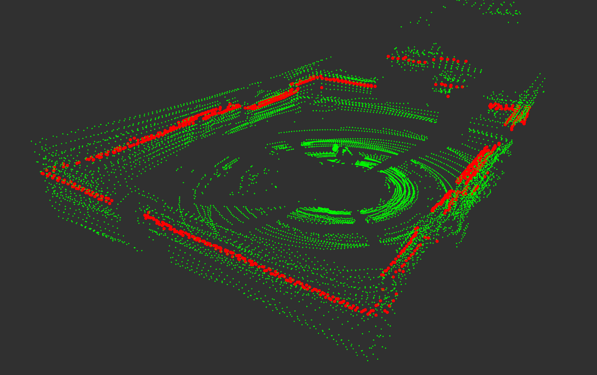

# Livox Converter ROS2

<div align="center">
<br>
Green: PointCloud2 & Red: LaserScan
</div>

## CustomMsg to PointCloud2

Convert `livox_ros_driver2::msg::CustomMsg` messages to `sensor_msgs::msg::PointCloud2` messages.

Subscribed topic:

- **/livox/lidar** &emsp;(`livox_ros_driver2::msg::CustomMsg`)

Published topic:

- **/livox/points** &emsp;(`sensor_msgs::msg::PointCloud2`)

## PointCloud2 to LaserScan

Convert `sensor_msgs::msg::PointCloud2` messages to `sensor_msgs::msg::LaserScan` messages.

Subscribed topic:

- **/livox/points** &emsp;(`sensor_msgs::msg::PointCloud2`)

Published topic:

- **/scan** &emsp;(`sensor_msgs::msg::LaserScan`)


## Dependency

* ROS2
* Livox-SDK2
* livox_ros_driver2

## Build

```bash
colcon build
```

## Run
```bash
. install/setup.bash
ros2 launch livox_converter livox_converter.launch.py
```

## Thanks for

[pointcloud_to_laserscan](https://github.com/ros-perception/pointcloud_to_laserscan): This is a ROS 2 package that provides components to convert `sensor_msgs/msg/PointCloud2` messages to `sensor_msgs/msg/LaserScan` messages and back.

[livox_to_pointcloud2](https://github.com/koide3/livox_to_pointcloud2): This package provides ROS1/ROS2 interfaces to convert 'livox_interfaces::msg::CustomMsg' into 'sensor_msgs::msg::PointCloud2'.